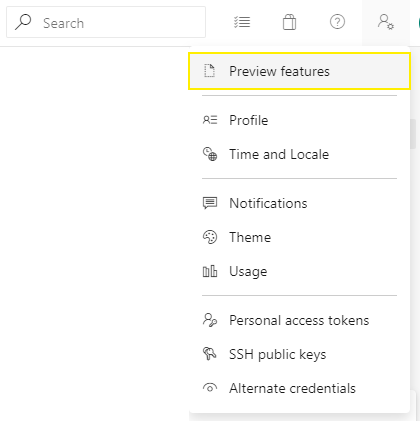
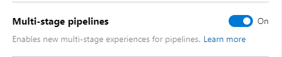
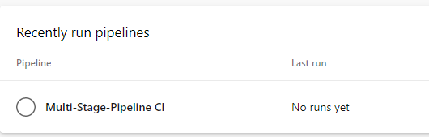
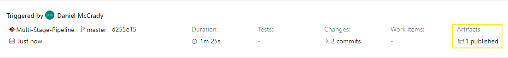

I wrote a blog post a long time ago about TFS and DevOps. A lot has changed since that last post with multiple different version of the build pipeline being released. Microsoft has been working hard to create a better experience for build automation and continuous integration. Recently they released the idea of multi-stage pipelines that work and feel much like how GitLab CI works.

In this post I'll walk through a basic YAML file and show how you can get a C# project up build and tested quickly.

# Setup

We need to have a project that is checked into DevOps before we begin. I have a [repository](https://dev.azure.com/focisolutions/_git/Multi-Stage-Pipeline) that I made for this blog up on DevOps that is a basic dotnet core console application and a unit test project that goes along with it. At the time of writing this blog post you will also need to turn on the multi-sgae pipelines Preview Feature in order to get the best view for these pipelines. You can do that by clicking on the user settings button


Then click on preview features



Then ensure that multi-stage pipelines are enabled




# First Steps

First we need to add a yaml file into our project. I tend to put this file directly at root and name it like azure-pipelines.yaml. Then we need to define our stages. A stage is a collection of jobs and can be run concurrently or can be dependent on another stage successfuly completing. For this quick project we will have two different stages
	• Build
	• Test

In order to define these stages in our pipeline we need to write some YAML like

``` yaml
stages:
  - stage: build
    displayName: Build
  - stage: test
    displayName: Test
    dependsOn:
    - build
```

this will give us our building blocks to add our jobs. If you check this file into DevOps and navigate to pipelines you can see that we have a pipeline defined without any runs associated to it.



# Adding a Job

A job runs on a build agent. By default DevOps provides hosted build agents that a preconfigured VM's that have a lot of different development tools preinstalled. I'll be using the hosted agents for this post.

Let's add in some YAML to add a job that will build our .net solution. We can do this in one of two ways, we can use a devops "task" or we can write a script. Tasks can provide a lot of features that you would normally need to script yourself. These can be very helpful, however it also hides a lot of what is being completed. I tend to try and use tasks and they get updated regulary to add additional features and other bug fixes. There aren't tasks for everything however so you will need to write some scripts eventually as well.

## Example as Task

``` yaml
variables:
  buildConfiguration: "Release"
  
stages:
- stage: build
  displayName: Build
  pool:
    vmImage: "Ubuntu 16.04"    
  jobs:
  - job: build_dotnet_solution
    displayName: build dotnet solution
    steps:
    - task: DotNetCoreCLI@2
      inputs:
        command: build
        arguments: '--configuration $(buildConfiguration)'
- stage: test
  displayName: Test
  dependsOn:
  - build
```

## Example as script

``` yaml
variables:
  buildConfiguration: "Release"
  
stages:
- stage: build
  displayName: Build
  pool:
    vmImage: "Ubuntu 16.04"    
  jobs:
  - job: build_dotnet_solution
    displayName: build dotnet solution
    steps:
    - script: |
      dotnet build --configuration $(buildConfiguration)
- stage: test
  displayName: Test
  dependsOn:
  - build
```

In both examples I have added a variable to se the build configuration setting for the pipeline. Variables are very helpful and DevOps also provides a lot of pre-defined variables for you. You can ready about them [here](https://docs.microsoft.com/en-us/azure/devops/pipelines/build/variables?view=azure-devops&tabs=yaml).

# Artifacts

Now that we have our job running and our sln is being build. We will probably want to hold onto these files. We will need to artifact these files if we want to use them in a different job, or we can download them later for manually testing the build.

``` yaml
variables:
  buildConfiguration: "Release"
  
stages:
- stage: build
  displayName: Build
  pool:
    vmImage: "Ubuntu 16.04"    
  jobs:
  - job: build_dotnet_solution
    displayName: build dotnet solution
    steps:
    - task: DotNetCoreCLI@2
      inputs:
        command: build
        arguments: '--configuration $(buildConfiguration)'
    - publish: $(System.DefaultWorkingDirectory)/src/demo-project/bin/$(buildConfiguration)/netcoreapp3.0/
      artifact: source
- stage: test
  displayName: Test
  dependsOn:
  - build
```

Once the build is completed you should see the artifacts on the build page. You can download them and use them in different jobs now.



# Testing

Now that we have our code built, we can go ahead and run the tests for our application. DevOps also has the ability to show us test results through its dashboards. It's easiest to use the task for this as the task has capabilities to upload the tests results for us.

``` yaml
variables:
  buildConfiguration: "Release"
  
stages:
- stage: build
  displayName: Build
  pool:
    vmImage: "Ubuntu 16.04"    
  jobs:
  - job: build_dotnet_solution
    displayName: build dotnet solution
    steps:
    - task: DotNetCoreCLI@2
      inputs:
        command: build
        arguments: '--configuration $(buildConfiguration)'
    - publish: $(System.DefaultWorkingDirectory)/src/demo-project/bin/$(buildConfiguration)/netcoreapp3.0/
      artifact: source
- stage: test
  displayName: Test
  dependsOn:
  - build
  jobs:
  - job: test_dotnet_solution
    displayName: test dotnet solution
    steps:
    - task: DotNetCoreCLI@2
      inputs:
        command: test
```